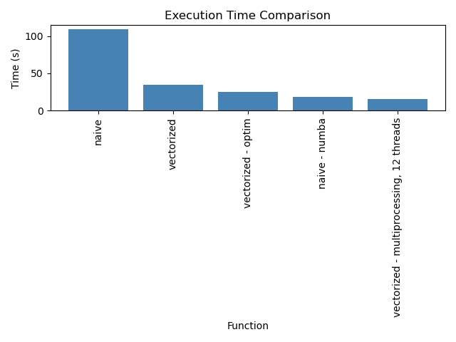

# Scientific Computing using Python – High Performance Computing in Python (2023)

This repository contains the code and documentation for calculating the Mandelbrot set as part of the course Scientific Computing using Python – High Performance Computing in Python at Aalborg University. The code is implemented in Python 3.11.3 using anaconda 1.11.2. All code considerations and results can be found at the [assignment](#assignment-the-mandelbrot-set).

## Installation

All code was developed in a docker container and vscode. To create all the figures and files for running the code, simply run the following command:

> This will firstly build the docker image and create the conda environment. This build process can take a long time. Secondly, the code will be run in the docker container. This will also take a long time, especially the benchmarking of the 15000x15000 dataset.

```bash
docker build -f docker/Dockerfile -t hpc_in_python ./docker
docker run -it --rm -v ${PWD}:/workspaces/Scientific_Computing_Mandelbrot -w /workspaces/Scientific_Computing_Mandelbrot hpc_in_python /bin/bash -c "pytest && python3 project.py"
```

Alternatively, the code can be run locally with [anaconda](https://www.anaconda.com/). Firstly, to recreate the environment, run the following command:

```bash
conda env create -f docker/environment.yml
```

Then activate the environment with:

```bash
conda activate scip_2
```

Finally, run the following command to create all the figures and files for running the code:

```bash
pytest && python3 project.py
```

The `project.py` script will do the following:

1. Create the dataset for the benchmarking with `src/create_dataset.py`.
   - Two datasets will be created. One with 5000x5000 complex numbers and one with 15000x15000 complex numbers.
2. Plot the Mandelbrot set with `src/mandelbrotplot.py`.
3. Profile three different implementations of the Mandelbrot set with `src/profile.py`.
4. Benchmark the functions, and compare threads with computational speedup. The benchmarking is done with `src/benchmark.py`.
   - The benchmarking will be done with the 5000x5000 and 15000x15000 datasets. The results will be saved in the `results` folder. Note the 15000x15000 dataset will take a long time to run and will require about 15 GB of RAM.

# Assignment: The Mandelbrot set

## The Mandelbrot set

The Mandelbrot set is a set of complex numbers defined by a simple iterative algorithm: for a given complex number 'c', start with 'z' equal to zero and repeatedly compute the next 'z' as the previous 'z' squared plus 'c'. If the magnitude of 'z' never exceeds 2 even after many iterations, 'c' is in the Mandelbrot set. A pseudo code implementation of this algorithm can be seen below.

```python
1: def M(c):
2:    z = 0
3:    for i in range(max_iters):
4:        z = z**2 + c
5:        if abs(z) > 2:
6:            return (i + 1) / max_iters
7:    return max_iters
```

The boundary of this set exhibits intricate, self-similar patterns known as fractals. A visual example of the Mandelbrot set can be seen below.

<p align = "center">

</p>
<p align = "center">
Fig.1 - A plot of the Mandelbrot set colored by a logarithmic scale of the number of iterations it took to escape.
</p>

## Assignment

In this project we have been tasked with implementing the Mandelbrot set in Python in differnet configurations and test the computational requirements. These configurations are:

1. A naive implementation of the Mandelbrot set.
2. A vectorized, numba, cython, or f2py implementation of the Mandelbrot set.
3. A multiprocessing implementation of the Mandelbrot set.

## Software Design and Considerations

This section underlines the key considerations about the software design and implementation. The software is implemented in Python 3.11.3 and is designed to be used as a module. No classes were implemented in this project, instead all functionality is implemented as functions. All necessary functionality for calculating the mandelbrot set is implemented in the `mandelbrot` module. The module contains the following:

- `mandelbrot.py`: Contains the main function for calculating the mandelbrot set.
- `mandelbrot_multiprocessing.py`: Contains a function for calculating the mandelbrot set using multiprocessing.
- `benchmark.py`: Contains a function for benchmarking the different implementations of the mandelbrot set.

The `mandelbrot` module is documented using docstrings. The docstrings are formatted according to the [Google Python Style Guide](https://google.github.io/styleguide/pyguide.html#38-comments-and-docstrings). The docstrings can be viewed using the `help` function in Python. E.g. `help(mandelbrot.calculate_mandelbrot_set)`.

The design of the software is based on the following considerations:

- Functions should be grouped by functionality in modules.
- Functions should be documented using docstrings.
- Functions should be tested using unit tests with the `pytest` package.
- Functions are named as verb-noun pairs in lower case, e.g. `calculate_mandelbrot_set`.
- Functions should have a single responsibility. E.g. a function that calculates the mandelbrot set should not also be responsible for plotting the set.
- Functions should have as few parameters as possible.
- All function parameters should be passed as arguments to avoid global variables.
- Function input and output type should be declared in the function.

## Testing

All functions are tested using unit tests. The unit tests are implemented using the `pytest` package and are located in the `tests` folder. The unit tests are documented with the GIVEN/WHEN/THEN pattern. An example of such a pattern could be:

```python
"""
GIVEN: The input to the function.
WHEN: The function is called.
THEN: The expected output of the function.
"""
```

To run the unit tests, simply run:

```bash
pytest
```

## Performance and optimization

The `src/profile.py` will run a profile of functions in the `mandelbrot` module with the `kernprof -l -v src/profile.py` command. The output for profiling the `calculate_mandebrot_naive` and `calculate_mandelbrot_vectorized` functions can be seen below. For the naive implementation most of the compute time is taken up by the for loop, calculating the next value of z, and determining if z has escaped. Combined these make up 98.5 % of the execution time. In the vectorized implementation 63 % of the compute time is at this step: `escaped_this_iter = np.abs(z) >= 2` - checking if the value of z has escaped. Calculating the whole Mandelbrot set with the vectorized implementation takes 36 seconds on my system. Let's see if we can optimize this further.

```
Total time: 0.00010028 s
File: /workspaces/scientific_computing_in_python/Scientific_Computing_Mandelbrot/mandelbrot/mandelbrot.py
Function: calculate_mandelbrot_naive at line 60

Line #      Hits         Time  Per Hit   % Time  Line Contents
==============================================================
    60                                           @profile
    61                                           def calculate_mandelbrot_naive(c: complex, max_iters: int = 100) -> float:
    62                                               """The naive implementation of the Mandelbrot set.
    63
    64                                               This function is the naive implementation of the Mandelbrot set. The naive approach is to disregard any vectorization and
    65                                               instead take a single value, c, and iterate until it escapes or the maximum number of iterations is reached.
    66                                               It is to be used with enumerate_mandelbrot_set
    67
    68
    69                                               Args:
    70                                                   c:
    71                                                       A complex number.
    72                                                   max_iters:
    73                                                       The maximum number of iterations.
    74
    75                                               Returns:
    76                                                   The number of iterations it took to escape.
    77
    78                                               Examples:
    79                                                   calculate_mandelbrot_naive(-2 + 1j, 100)
    80
    81                                               """
    82                                               # Initialize z and c
    83         1          1.0      1.0      1.0      z = 0
    84
    85                                               # Iterate until the maximum number of iterations is reached
    86       100         37.4      0.4     37.3      for i in range(max_iters):
    87                                                   # Calculate the next value of z
    88       100         28.3      0.3     28.2          z = z**2 + c
    89
    90                                                   # Check if z has escaped
    91       100         33.2      0.3     33.1          if abs(z) > 2:
    92                                                       return (i + 1) / max_iters
    93
    94                                               # If z has not escaped, return the maximum number of iterations
    95         1          0.2      0.2      0.2      return 1
```

```
Total time: 36.3712 s
Function: calculate_mandelbrot_vectorized at line 99

Line #      Hits         Time  Per Hit   % Time  Line Contents
==============================================================
    99                                           @profile
   100                                           def calculate_mandelbrot_vectorized(C: np.ndarray, max_iters: int = 100) -> np.ndarray:
   101                                               """the vectorized implementation of the Mandelbrot set.
   102
   103                                               This version is the vectorized implementation of the Mandelbrot set. It uses numpy arrays and operations to
   104                                               calculate the Mandelbrot set for each element in C.
   105
   106                                               Args:
   107                                                   C:
   108                                                       A 2D array of complex numbers.
   109                                                   max_iters:
   110                                                       The maximum number of iterations.
   111
   112                                               Returns:
   113                                                   A 2D array of the number of iterations it took to escape.
   114
   115                                               Examples:
   116                                                   C = np.array([[-2 + 1j, -2 + 1j], [-2 + 1j, -2 + 1j]])
   117                                                   calculate_mandelbrot_vectorized(C, 100)
   118
   119                                               """
   120                                               # Initialize z and c
   121         1         22.8     22.8      0.0      z = np.zeros(C.shape, np.complex128)
   122         1          5.5      5.5      0.0      mandelbrotSet = np.zeros(C.shape, np.float64)
   123         1       3345.3   3345.3      0.0      escaped = np.zeros_like(mandelbrotSet, dtype=bool)
   124
   125                                               # Iterate until the maximum number of iterations is reached
   126       100         98.3      1.0      0.0      for i in range(max_iters):
   127                                                   # Calculate the next value of z only for those elements where z has not escaped yet. The ~ is a bitwise NOT i.e it flips true to false and vice versa
   128       100     290140.5   2901.4      0.8          mask = ~escaped
   129       100    7888983.1  78889.8     22.3          z[mask] = z[mask] ** 2 + C[mask]
   130
   131                                                   # Check if z has escaped
   132       100   22166665.4 221666.7     62.7          escaped_this_iter = np.abs(z) >= 2
   133
   134                                                   # Update the mandelbrot set
   135       100    3959990.8  39599.9     11.2          mandelbrotSet = np.where(
   136       100     609398.4   6094.0      1.7              escaped_this_iter & ~escaped, (i + 1) / max_iters, mandelbrotSet
   137                                                   )
   138                                                   # Update the escaped array. The | is a bitwise OR i.e. if either of the elements is true, the result is true
   139       100     400439.4   4004.4      1.1          escaped = escaped | escaped_this_iter
   140
   141         1      52151.8  52151.8      0.1      mandelbrotSet = np.where(mandelbrotSet == 0, 1, mandelbrotSet)
   142         1          0.4      0.4      0.0      return mandelbrotSet
```

The absolute value or modulus of a complex number is defined by the formula: `|a + bi| = sqrt(a^2 + b^2)`. This is a complex calculation as it involves a square root. However, we can get rid of the square root computation by squaring the real and imaginary part, thereby `abs(z) >= 2 == (z.real**2 + z.imag**2) >= 4`. This is a much simpler calculation. Lets see if this reduces the computational time? - ofcourse we also test the new version to test if it is correct.

With this implementation the calculation time is reduced to 25.4289 s. This is a 30% improvement over the previous version.

```
Total time: 25.4289 s
Function: calculate_mandelbrot_vectorized_optim at line 145

Line #      Hits         Time  Per Hit   % Time  Line Contents
==============================================================
   145                                           @profile
   146                                           def calculate_mandelbrot_vectorized_optim(
   147                                               C: np.ndarray, max_iters: int = 100
   148                                           ) -> np.ndarray:
   149                                               """the vectorized implementation of the Mandelbrot set.
   150
   151                                               This version is the vectorized implementation of the Mandelbrot set. It uses numpy arrays and operations to
   152                                               calculate the Mandelbrot set for each element in C.
   153
   154                                               Args:
   155                                                   C:
   156                                                       A 2D array of complex numbers.
   157                                                   max_iters:
   158                                                       The maximum number of iterations.
   159
   160                                               Returns:
   161                                                   A 2D array of the number of iterations it took to escape.
   162
   163                                               Examples:
   164                                                   C = np.array([[-2 + 1j, -2 + 1j], [-2 + 1j, -2 + 1j]])
   165                                                   calculate_mandelbrot_vectorized(C, 100)
   166
   167                                               """
   168                                               # Initialize z and c
   169         1         19.0     19.0      0.0      z = np.zeros(C.shape, np.complex128)
   170         1          5.5      5.5      0.0      mandelbrotSet = np.zeros(C.shape, np.float64)
   171         1        923.8    923.8      0.0      escaped = np.zeros_like(mandelbrotSet, dtype=bool)
   172
   173                                               # Iterate until the maximum number of iterations is reached
   174       100         83.1      0.8      0.0      for i in range(max_iters):
   175                                                   # Calculate the next value of z only for those elements where z has not escaped yet. The ~ is a bitwise NOT i.e it flips true to false and vice versa
   176       100     289655.6   2896.6      1.1          mask = ~escaped
   177       100    7825834.0  78258.3     30.8          z[mask] = z[mask] ** 2 + C[mask]
   178
   179                                                   # Check if z has escaped
   180       100   12271922.7 122719.2     48.3          escaped_this_iter = (z.real**2 + z.imag**2) >= 4
   181
   182                                                   # Update the mandelbrot set
   183       100    3968136.9  39681.4     15.6          mandelbrotSet = np.where(
   184       100     612949.2   6129.5      2.4              escaped_this_iter & ~escaped, (i + 1) / max_iters, mandelbrotSet
   185                                                   )
   186                                                   # Update the escaped array. The | is a bitwise OR i.e. if either of the elements is true, the result is true
   187       100     402588.1   4025.9      1.6          escaped = escaped | escaped_this_iter
   188
   189         1      56751.4  56751.4      0.2      mandelbrotSet = np.where(mandelbrotSet == 0, 1, mandelbrotSet)
   190         1          0.3      0.3      0.0      return mandelbrotSet
```

## Benchmarking

All functions were benchmarked using the `timeit` module. The benchmarking code is in the `benchmark.py` file. The benchmarking code was run on a ubuntu 22.04 machine with Intel(R) Core(TM) i5-10400T CPU @ 2.00GHz with 6 cores and 24 GB of RAM. The calculations were done on a 5000 x 5000 grid of complex numbers between `Re = [-2, 1]` and `Im = [-1.5, 1.5]` with 100 iterations. The results are shown below:

<p align = "center">

</p>
<p align = "center">
Fig.2 - A performance plot of the different implementations for calculating the Mandebrot set.
</p>

The naive approach is the slowest and the parallelized version was the fastest. Interestingly the version with numba was almost as fast as the parallelized version. Also it can be seen the optimized vectorized version was about ten seconds faster.

### Threads vs Time

The parallelized version was run with different number of threads to see how the number of threads affects the time taken to calculate the Mandelbrot set. The results are shown below:

<p align = "center">

</p>
<p align = "center">
Fig.3 - A plot of the computational speedup as a function of the number of threads. 
</p>

After 4 threads there does not seem to be a significant speed-up. This is likely because the overhead of parallelizing the work between the threads is more than the time saved by parallelizing the work. In theory if the dataset was bigger then the speedup should continue to increase until it reaches 6 threads. Lets test this idea. Below is the result of running 1 to 6 threads on a 15000 x 15000 grid of complex numbers between `Re = [-2, 1]` and `Im = [-1.5, 1.5]` with 100 iterations.

<p align = "center">

</p>
<p align = "center">
Fig.4 - A plot of the computational speedup as a function of the number of threads on a 15000x15000 dataset. 
</p>

Increasing the dataset size does not give a speedup for 6 threads compared to 4 threads. Therefore, there must be another bottleneck hampering the performance of the parallelized version.
